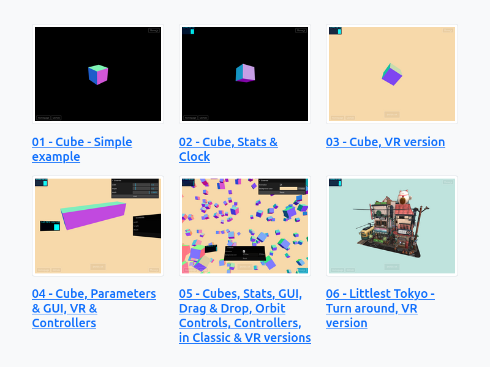

:toc: macro
:toc-title: Summary
:toclevels: 3
:numbered:

ifndef::env-github[:icons: font]
ifdef::env-github[]
:status:
:outfilesuffix: .adoc
:caution-caption: :fire:
:important-caption: :exclamation:
:note-caption: :paperclip:
:tip-caption: :bulb:
:warning-caption: :warning:
endif::[]

:back_to_top_target: top-target
:back_to_top_label: ⬆ Back to top
:back_to_top: <<{back_to_top_target},{back_to_top_label}>>

:main_title: Three.js - Sandbox
:git_project: three.js-sandbox
:git_username: jprivet-dev
:git_url: https://github.com/{git_username}/{git_project}
:git_clone_ssh: git@github.com:{git_username}/{git_project}.git

[#{back_to_top_target}]
= {main_title}

toc::[]

== Presentation

Test area with https://threejs.org/[Three.js].
See the result on https://www.jprivet.dev/three.js-sandbox/.

{back_to_top}

== Prerequisites

* Be sure to install the latest version of :
** https://nodejs.org/en/[Node.js].
** https://www.npmjs.com/package/http-server[http-server] with `$ npm install --global http-server`.

{back_to_top}

== Installation

. `$ git clone {git_clone_ssh}`.
. `$ cd {git_project}`.
. `$ http-server . -p 8000`: run files from a local web server.
. Open your browser on http://127.0.0.1:8000.

{back_to_top}

== Emulate XR devices in your browser

* GitHub: https://github.com/MozillaReality/WebXR-emulator-extension[WebXR emulator extension] by https://github.com/MozillaReality[Mozilla Mixed Reality]
* Firefox extension: https://addons.mozilla.org/en-US/firefox/addon/webxr-api-emulator/[WebXR API Emulator]
* Chrome extension: https://chrome.google.com/webstore/detail/webxr-api-emulator/mjddjgeghkdijejnciaefnkjmkafnnje[WebXR API Emulator]

{back_to_top}

== Resources

* https://threejs.org/
* https://threejs.org/docs/#manual/en/introduction/How-to-run-things-locally

{back_to_top}

== Comments, suggestions?

Feel free to make comments/suggestions to me in the {git_url}/issues[Git issues section].

{back_to_top}

== License

"{main_title}" is released under the {git_url}/blob/main/LICENSE[*MIT License*].

---

{back_to_top}